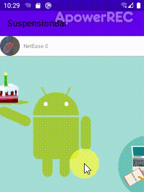

### SuspensionBarRecyclerView
> 屏幕中RecyclerView展示的第一个可视条目的头可以悬浮在RecyclerView控件顶端.
> [源码分析](https://blog.csdn.net/MoLiao2046/article/details/106025618)
##### 依赖
```groovy
implementation 'com.yey.suspensionbarrv:library:0.0.1'
```
##### 布局
```xml
<com.yey.sbrv.SuspensionBarRecyclerView
    android:id="@+id/shrv"
    android:layout_width="match_parent"
    android:layout_height="match_parent"
    app:layout_behavior="@string/appbar_scrolling_view_behavior"
    app:sbrv_bar="@layout/item_head"
    app:sbrv_bar_height="wrap_content" />
```
- 控件属性解释
    1. sbrv_bar: 悬挂条布局
    2. sbrv_bar_height: 悬挂条高度
##### 代码
```java
// 这里是设置更新悬挂条的回调
binding.shrv.setUpdateSuspensionBarListener(new SuspensionBarRecyclerView.UpdateSuspensionBarListener() {
    @Override
    public void updateSuspensionBar(View mSuspensionBar, int mFirstVisibleIndex) {
        // 例如Item的Head有ImageView或者TextView需要更新,在这里做.
        ImageLoader.getInstance().displayImage(MyAdapter.getAvatarResUrl(mFirstVisibleIndex), ((ImageView) mSuspensionBar.findViewById(R.
        ((TextView) mSuspensionBar.findViewById(R.id.tv_nickname)).setText("NetEase " + mFirstVisibleIndex);
    }
});
// 设置好Adapter,Adpater和普通Adapter没有什么不同.
binding.shrv.setAdapter(new MyAdapter());
```
使用详情可以看Demo中如何做的, 非常的简单.
#### 效果图




